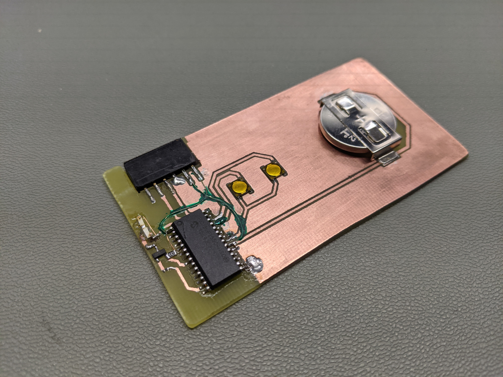

# IR Volume Control

Volume control using DigiPot controlled by infrared remote control.

# IR Controllable Digipot

This part of the project is a what is actually controlling sound volume. It is
a digipot which is controlled by an infrared remote controller (similar to the
ones used by TVs).

The design and firmware files are in the `IR-Digipot` folder.

# IR Controller

This is a minimalistic implementation of infrared remote controller. It talks
to the `IR-Digipot`. Can be easily extended with more buttons to consolidate
all the remote controllers in the house!

## Licensing

All the work done and implemented for this project is licensed under the
terms of MIT license.
